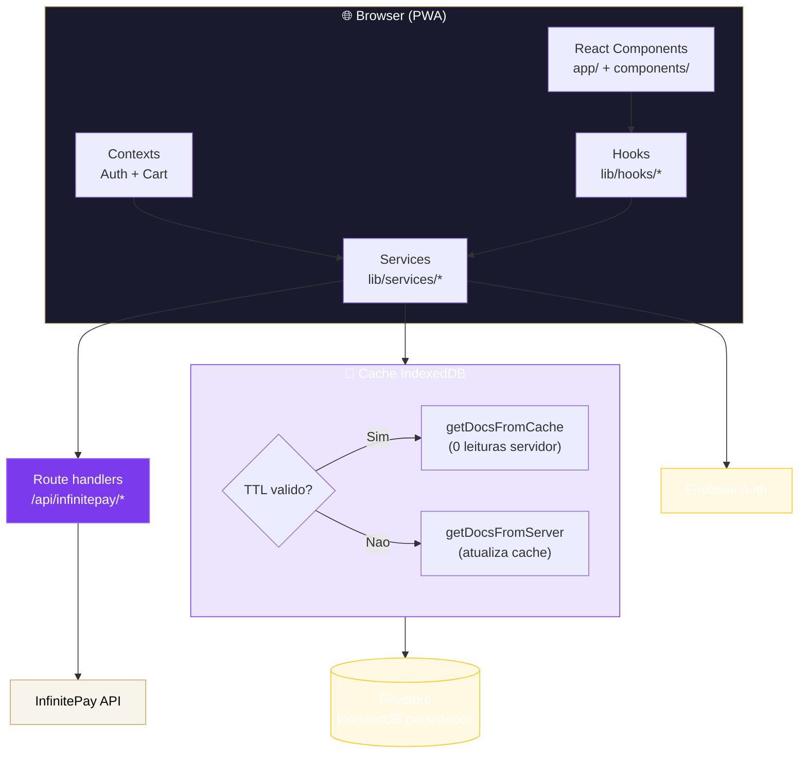
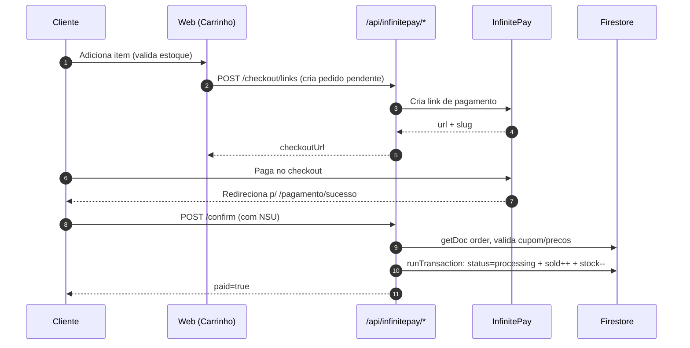

<p align="center">
  <a href="https://github.com/DinDja/Tsara_Marketplace" target="_blank" rel="noopener">
    
  </a>
</p>

<h1 align="center">TSARA ✦ Sabedoria Ancestral</h1>

<p align="center">
  Plataforma web mística: loja esoterica + agendamento de consultas + chat de suporte.<br/>
  Construida com Next.js 16, React 19, Firebase v12 e checkout via InfinitePay.
</p>

<p align="center">
  <a href="https://github.com/DinDja/Tsara_Marketplace/actions/workflows/ci.yml">
    
  </a>
  
  
  
  
  
  
  
  
  
</p>

<p align="center">
  <a href="#instalacao-e-execucao">🚀 Instalar</a> &nbsp;·&nbsp;
  <a href="#arquitetura">🏛️ Arquitetura</a> &nbsp;·&nbsp;
  <a href="#galeria">🖼️ Galeria</a> &nbsp;·&nbsp;
  <a href="#configuracao">⚙️ Configurar</a> &nbsp;·&nbsp;
  <a href="#roadmap">🗺️ Roadmap</a>
</p>

<br/>

---

<br/>

## ✨ Sobre

**TSARA** é uma experiência web completa para um negocio esoterico: catalogo de produtos (cristais, velas, incensos, oraculos), agendamento de consultas (tarot, baralho cigano, sessao completa), carrinho com cupom/frete/endereco, checkout transparente com InfinitePay, painel administrativo, chat de suporte em tempo real e PWA instalavel.

> [!NOTE]
> O sistema ja conta com **cache IndexedDB** sobre o SDK do Firestore, reduzindo leituras cobradas no servidor por colecao (TTL por colecao + invalidacao apos escrita).

<br/>

## 📑 Sumario

- [Sobre](#sobre)
- [Galeria](#galeria)
- [Principais funcionalidades](#principais-funcionalidades)
- [Stack](#stack)
- [Arquitetura](#arquitetura)
- [Estrutura de pastas](#estrutura-de-pastas)
- [Instalacao e execucao](#instalacao-e-execucao)
- [Configuracao](#configuracao)
- [Importacao de produtos (Luar)](#importacao-de-produtos-luar)
- [Fluxo de pedido e estoque](#fluxo-de-pedido-e-estoque)
- [Autenticacao e autorizacao](#autenticacao-e-autorizacao)
- [Regras de seguranca](#regras-de-seguranca)
- [PWA](#pwa)
- [CI/CD](#cicd)
- [Padroes tecnicos](#padroes-tecnicos)
- [Troubleshooting](#troubleshooting)
- [Roadmap](#roadmap)
- [Licenca](#licenca)

<br/>

## 🖼️ Galeria

<table>
  <tr>
    <td width="33%" align="center"><b>🔮 Cristais</b></td>
    <td width="33%" align="center"><b>🕯️ Velas</b></td>
    <td width="33%" align="center"><b>🌿 Incensos</b></td>
  </tr>
  <tr>
    <td></td>
    <td></td>
    <td></td>
  </tr>
  <tr>
    <td align="center"><b>🃏 Tarot</b></td>
    <td align="center"><b>🌙 Baralho Cigano</b></td>
    <td align="center"><b>💎 Ametista</b></td>
  </tr>
  <tr>
    <td></td>
    <td></td>
    <td></td>
  </tr>
</table>

<table>
  <tr>
    <td width="33%" align="center"><b>🃏 Tarot</b></td>
    <td width="33%" align="center"><b>🌙 Baralho Cigano</b></td>
    <td width="33%" align="center"><b>✦ Sessao Completa</b></td>
  </tr>
  <tr>
    <td></td>
    <td></td>
    <td></td>
  </tr>
</table>

<p align="center"><em>Banner mistico</em></p>
<p align="center"></p>

<br/>

## 🌟 Principais funcionalidades

<details open>
<summary><b>🧙 Experiencia do cliente</b></summary>

- Home institucional com hero, destaques, consultas, opinioes e sobre
- Catalogo com filtragem por categoria e busca textual
- Pagina de detalhe do produto com avaliacoes
- Carrinho inteligente:
  - controle de quantidade
  - validacao de estoque
  - cupom de desconto
  - calculo de frete
  - selecao de endereco
- Checkout transparente via InfinitePay
- Pagina de sucesso com verificacao de pagamento
- Meus pedidos (filtros, busca e detalhes)
- Agendamento de consulta em **stepper de 6 passos** (Tipo → Data → Horario → Dados → Revisao → Sucesso)
- Minha conta (dados, enderecos, seguranca)
- Minhas consultas
- Chat de suporte flutuante
- Instalavel como **PWA**

</details>

<details>
<summary><b>⚙️ Painel administrativo</b></summary>

- Dashboard consolidado (receita, agendamentos, produtos vendidos, novos clientes)
- Gestao de agendamentos (alterar status, notas)
- Gestao de tipos de consulta
- CRUD completo de produtos com upload de imagem
- Gestao de pedidos com alteracao de status
- Gestao de clientes
- Gestao de cupons (codigo, desconto, validade, limite de uso)
- Tela de configuracoes
- Tela de semeacao para popular dados iniciais
- Chat de atendimento ao cliente em tempo real

</details>

<br/>

## 🧰 Stack

<table>
  <tr>
    <th width="22%">Camada</th>
    <th>Tecnologia</th>
  </tr>
  <tr>
    <td><b>Framework</b></td>
    <td> <em>App Router + Turbopack</em></td>
  </tr>
  <tr>
    <td><b>UI</b></td>
    <td> +  +  + </td>
  </tr>
  <tr>
    <td><b>Animacao</b></td>
    <td>Framer Motion 12 + Sonner (toasts) + Lottie</td>
  </tr>
  <tr>
    <td><b>Forms</b></td>
    <td>React Hook Form + Zod</td>
  </tr>
  <tr>
    <td><b>Backend</b></td>
    <td> <em>Auth (email/senha + Google) + Firestore + cache IndexedDB</em></td>
  </tr>
  <tr>
    <td><b>Pagamento</b></td>
    <td>InfinitePay (links de checkout, verificacao, webhook)</td>
  </tr>
  <tr>
    <td><b>Imagens</b></td>
    <td>react-image-crop + compressao base64 em chunks</td>
  </tr>
  <tr>
    <td><b>PWA</b></td>
    <td>Manifest (<code>app/manifest.ts</code>) + Service Worker (<code>public/sw.js</code>)</td>
  </tr>
</table>

<br/>

## 🏛️ Arquitetura



<details>
<summary><b>Fluxo de pedido e estoque</b></summary>



</details>

<br/>

## 📁 Estrutura de pastas

```text
TSARA/
├── app/                       # Rotas (App Router)
│   ├── admin/                  # Painel admin
│   │   ├── agendamentos/  clientes/  configuracoes/
│   │   ├── consultas/    chat/        cupons/
│   │   ├── pedidos/      produtos/    sementes/
│   │   └── ...
│   ├── agendamento/            # Stepper de 6 passos
│   ├── api/infinitepay/        # Route handlers (server)
│   │   ├── confirm/            # Confirmacao + atualizacao do pedido
│   │   ├── invoices/public/checkout/
│   │   │   ├── links/          # Cria link de pagamento
│   │   │   └── payment_check/
│   │   └── webhook/            # Webhook de pagamento
│   ├── carrinho/  chat/  consultas/  conta/  cursos/
│   ├── login/  meus-pedidos/  minhas-consultas/
│   ├── pagamento/sucesso/      # Retorno do checkout
│   ├── produto/[id]/  produtos/
│   ├── layout.tsx  manifest.ts  providers.tsx
├── components/
│   ├── scheduling/             # Cards do stepper de agendamento
│   ├── ui/                     # Primitives (shadcn-style)
│   ├── chat-float-button.tsx  pwa-register.tsx
│   └── header.tsx  hero.tsx  footer.tsx  ...
├── lib/
│   ├── contexts/               # auth-context, cart-context
│   ├── firebase/
│   │   ├── admin.ts            # Admin SDK (server-side)
│   │   ├── config.ts           # init + persistencia IndexedDB
│   │   └── firecache.ts        # cache com TTL por colecao
│   ├── hooks/                  # hooks de consumo
│   ├── services/               # acesso a dados (Firestore)
│   ├── infinitePay/            # config da InfinitePay
│   ├── types.ts                # tipos do dominio
│   └── utils.ts
├── public/                     # assets estaticos
│   ├── products/*.jpg          # fotos de produtos
│   ├── consultations/*.jpg     # fotos de consultas
│   ├── Moon.json               # animacoes Lottie
│   ├── moon.jpg                # banner mistico
│   ├── icon-512.png            # logo oficial
│   └── sw.js                   # service worker
├── scripts/
│   └── import-luar-products.mjs
├── styles/
│   ├── globals.css
│   └── chat-animations.css
├── .github/workflows/ci.yml    # CI (lint + build)
├── firestore.rules             # regras de seguranca
├── firestore.indexes.json
├── firebase.json
├── next.config.mjs
├── tailwind.config.ts
├── tsconfig.json
└── package.json
```

<br/>

## 🚀 Instalacao e execucao

### Pre-requisitos

- **Node.js 20+**
- NPM (ou pnpm/yarn, se preferir)
- Projeto Firebase ativo com **Auth + Firestore** habilitados

```bash
# 1. Clonar
git clone https://github.com/DinDja/Tsara_Marketplace.git
cd TSARA

# 2. Instalar dependencias
npm install

# 3. Rodar em desenvolvimento (Turbopack)
npm run dev
```

App disponivel em <http://localhost:3000>

```bash
# Build de producao
npm run build && npm run start

# Lint
npm run lint

# Typecheck (verifica erros TypeScript)
npx tsc --noEmit
```

> [!TIP]
> Mantenha `turbopack.root` em `next.config.mjs` apontando para o diretorio do TSARA. Sem isso, se houver `package-lock.json` em diretorio pai, a resolucao de caminhos CSS (`@import '../styles/...'`) quebra.

> [!WARNING]
> `next.config.mjs` esta com `typescript.ignoreBuildErrors = true`. Em producao, considere remover para nao mascarar erros de tipo.

<br/>

## ⚙️ Configuracao

### Firebase

**Arquivo:** `lib/firebase/config.ts`

Ajuste o objeto `firebaseConfig` para o seu projeto Firebase. O sistema ja habilita:

- **`initializeFirestore(app, { cacheSizeBytes: CACHE_SIZE_UNLIMITED })`** — cache sem limite de tamanho.
- **`enableIndexedDbPersistence(db)`** — persistencia offline (captura erros em SSR/outra aba).

### Cache IndexedDB (reducao de leituras)

**Arquivo:** `lib/firebase/firecache.ts`

Le do cache do Firestore via `getDocsFromCache` (zero leituras no servidor). So busca no servidor quando o **TTL expira** ou cache vazio. Invalida automaticamente apos escritas.

<table>
  <tr><th>Colecao</th><th>TTL</th><th>Justificativa</th></tr>
  <tr><td><code>consultations</code></td><td>1h</td><td>catalogo raramente muda</td></tr>
  <tr><td><code>products</code></td><td>5min</td><td>preco/estoque podem mudar</td></tr>
  <tr><td><code>coupons</code></td><td>1h</td><td>mudam pouco</td></tr>
  <tr><td><code>reviews</code></td><td>15min</td><td>—</td></tr>
  <tr><td><code>cursos</code></td><td>1h</td><td>—</td></tr>
  <tr><td><code>appointments</code></td><td>30s</td><td>alta volatilidade de slot</td></tr>
  <tr><td><code>orders</code></td><td>30s</td><td>—</td></tr>
  <tr><td><code>clients</code> / <code>users</code></td><td>1-5min</td><td>edicao admin frequente</td></tr>
  <tr><td><em>default</em></td><td>1min</td><td>fallback</td></tr>
</table>

**Como estender o cache a um service:**

```ts
import { cachedQuery, cachedDoc, invalidateCache } from "@/lib/firebase/firecache"

const snap = await cachedQuery("products:all", col, "products")     // colecao
const snap = await cachedDoc(`products:doc:${id}`, ref, "products") // documento
invalidateCache("products")                                         // apos mutacao
```

Ja integrado em: <code>consultations</code>, <code>products</code>, <code>coupons</code>, <code>appointments</code> (parcial).

### InfinitePay

**Arquivo:** `lib/infinitePay/config.ts`

```bash
INFINITEPAY_HANDLE=seu-handle   # caso nao use DEFAULT_HANDLE do arquivo
```

<br/>

## 🛒 Importacao de produtos (Luar)

O projeto inclui um importador real para `https://www.luar.com.br` que usa os endpoints publicos do proprio catalogo da Luar.

```bash
# Dry-run: conferir volumes, categorias e amostras
npm run import:luar

# Gravar no Firestore (precisa da Firebase Admin SDK)
npm run import:luar -- --write
```

Caminho padrao da service account: `public/tsara-ab3fc-firebase-adminsdk-fbsvc-82add8080a.json`

<details>
<summary><b>Opcoes avancadas</b></summary>

```bash
# Caminho alternativo
npm run import:luar -- --write --service-account=./firebase-adminsdk.json

# Variavel de ambiente
TSARA_FIREBASE_SERVICE_ACCOUNT=./firebase-adminsdk.json npm run import:luar -- --write

# Apenas categorias especificas
npm run import:luar -- --category=4,10 --limit=20

# Apenas produtos ativos
npm run import:luar -- --write --active-only

# Sobrescrever campos comerciais
npm run import:luar -- --write --overwrite-commerce
```

</details>

> [!NOTE]
> A Luar publica nome, descricao, status, destaque e imagens, mas **nao** publica preco nem estoque numerico. Produtos importados entram como `priceOnRequest: true` e `stockManaged: false`, aparecendo como "Sob consulta" ate serem preenchidos no TSARA.

<br/>

## 🔐 Autenticacao e autorizacao

- **Firebase Auth** (email/senha + Google)
- Perfil do usuario em `users/{uid}` no Firestore
- Acesso admin depende de `role: "admin"` no documento do usuario

Para promover um usuario a admin:

```json
{
  "role": "admin"
}
```

<br/>

## 🛡️ Regras de seguranca

**Arquivo:** `firestore.rules`

<table>
  <tr><th>Colecao</th><th>Read</th><th>Write</th></tr>
  <tr><td><code>products</code>, <code>consultations</code>, <code>cursos</code>, <code>reviews</code></td><td>publica</td><td>admin (review: create autenticado)</td></tr>
  <tr><td><code>appointments</code></td><td>admin ou dono</td><td>create: qualquer um (publico); update: admin ou dono limitado</td></tr>
  <tr><td><code>orders</code></td><td>admin ou dono</td><td>create: dono autenticado (pending); update: admin ou dono limitado</td></tr>
  <tr><td><code>clients</code></td><td>admin ou dono</td><td>admin ou dono</td></tr>
  <tr><td><code>coupons</code></td><td>autenticado</td><td>admin</td></tr>
  <tr><td><code>users</code></td><td>autenticado</td><td>proprio (sem role) ou admin</td></tr>
  <tr><td><code>users/{uid}/addresses</code>, <code>/cards</code></td><td>autenticado (dono ou admin)</td><td>autenticado</td></tr>
  <tr><td><code>chats</code>, <code>chats/{id}/messages</code></td><td>admin ou dono do chat</td><td>participantes</td></tr>
  <tr><td><em>demais</em></td><td>negado</td><td>negado</td></tr>
</table>

Deploy: `firebase deploy --only firestore:rules`

<br/>

## 📱 PWA

- Manifesto em `app/manifest.ts`
- Service Worker (registro em `components/pwa-register.tsx`, arquivo em `public/sw.js`)
- Icones: `public/icon-192.png`, `public/icon-512.png`, `public/apple-icon.png`
- Banner de instalacao com opcao de fechar

<br/>

## 🔁 CI/CD

O projeto possui um workflow do GitHub Actions em `.github/workflows/ci.yml` que roda em push/PR para `main`/`master`:

1. Checkout do repositorio
2. Setup Node 20 com cache npm
3. `npm ci`
4. `npx tsc --noEmit` (typecheck)
5. `npm run build`

<p>
  <a href="https://github.com/DinDja/Tsara_Marketplace/actions/workflows/ci.yml">
    
  </a>
</p>

<br/>

## 🧪 Padroes tecnicos

| Padrao | Descricao |
|---|---|
| **Estado global** | leve via Context API (`AuthProvider`, `CartProvider`) — sem Redux |
| **Acesso a dados** | centralizado em `lib/services/*` (facil de substituir/mockar) |
| **Hooks** | `lib/hooks/*` ponte entre UI e services |
| **UI modular** | primitivas shadcn-style em `components/ui/*` |
| **Cache** | TTL por colecao sobre o cache nativo do Firestore (`firecache.ts`) |
| **Imagens** | `images.unoptimized = true` (sem otimizacao automatica do Next) |
| **Turbopack root** | configurado em `next.config.mjs` para resolver caminhos do workspace |

<br/>

## 🧯 Troubleshooting

<details>
<summary><b>Nao consigo entrar no admin</b></summary>

Verifique se o usuario possui `role: "admin"` em `users/{uid}` no Firestore.
</details>

<details>
<summary><b>Checkout nao abre</b></summary>

Verifique a variavel `INFINITEPAY_HANDLE` e a conectividade com `/api/infinitepay/...`.
</details>

<details>
<summary><b>Dados nao aparecem no painel</b></summary>

Confirme as regras do Firestore (`firestore.rules`) e a permissao do usuario autenticado.
</details>

<details>
<summary><b>Estoque estranho no carrinho</b></summary>

Limpe o carrinho local e reabra (`localStorage` chave `tsara-cart`), ou remova itens invalidos pela UI.
</details>

<details>
<summary><b>Erro <code>Can't resolve '../styles/chat-animations.css'</code></b></summary>

Mantenha `turbopack.root` em `next.config.mjs` apontando para o diretorio do TSARA. Ocorre quando ha `package-lock.json` em diretorio pai.
</details>

<br/>

## 🗺️ Roadmap

- [x] Cache IndexedDB com TTL por colecao (`firecache.ts`)
- [x] Race condition de slot de agendamento via transaction lock
- [x] Validacao de itens no checkout (descricao/quantidade/preco)
- [x] Refatoracao do AgendamentoComponent em sub-componentes
- [ ] Estender cache IndexedDB aos services restantes (`clients`, `courses`, `orders`, `reviews`, `dashboard`)
- [ ] Testes automatizados (unitarios + integracao)
- [ ] Webhook completo de pagamento (atualizacao server-side robusta)
- [ ] Observabilidade (logs estruturados + monitoramento)
- [ ] Remover `typescript.ignoreBuildErrors` do `next.config.mjs`
- [ ] Hardening de regras e politicas de deploy

<br/>

## 📄 Licenca

Projeto **privado** (`private: true` no `package.json`).

<br/>

<p align="center">
  Feito com <span style="color:#C9A86C">✦</span> para iluminar caminhos
</p>

<p align="center">
  <a href="#top">↑ Voltar ao topo</a>
</p>
